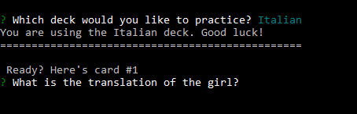
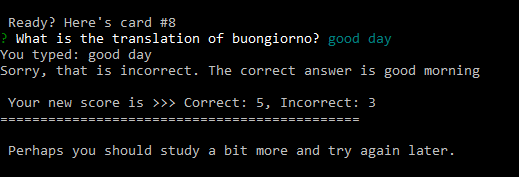

# flashcards
A command-line flashcard application using Node.js

Download and type "npm install" in your command-line console.
To start the app, run node cards.js

Screenshots:
---------------------------------------------------------

When the app starts, the app asks you to select a language deck.

</img>

After choosing a deck, the app randomizes which side of the card it will show you and asks you to translate it.

</img>

When you give an answer, the app will return the answer you gave and whether or not it is correct.

</img>

The app also keeps track of your score.  If you reach 10 correct answers or 3 incorrect answers, the game ends.

</img>

Thanks for looking!
